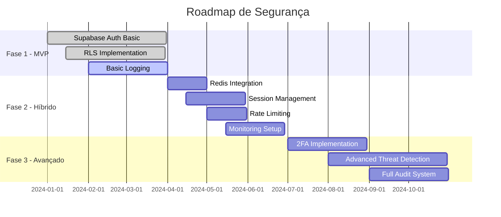

# 🔐 Estratégia de Segurança e Autenticação

## 📋 Visão Geral

Este documento define a estratégia de evolução da segurança do sistema de gestão de obras, partindo de uma implementação simples para validação até uma arquitetura robusta de produção.

## 🎯 Estratégia de Evolução

### Fase 1: MVP - Validação (Atual) ✅
**Objetivo:** Validar o conceito e funcionalidades principais
**Prazo:** Primeiros 3 meses
**Implementação:** Autenticação básica com Supabase

```
Usuário → Supabase Auth → RLS → Dados
```

**Características:**
- ✅ Autenticação via Supabase Auth
- ✅ JWT gerenciado pelo Supabase
- ✅ RLS (Row Level Security) ativo
- ✅ HTTPS obrigatório
- ⏳ Sem cache (Redis opcional)
- ⏳ Logs básicos

**Justificativa:** 
- Desenvolvimento rápido
- Foco na validação de features
- Segurança adequada para testes
- Menor complexidade de manutenção

### Fase 2: Produção Inicial - Sistema Híbrido 🚀
**Objetivo:** Melhorar performance e controle
**Prazo:** Meses 4-6
**Implementação:** Supabase + Tokens próprios + Cache

```
Usuário → Supabase Auth → Nossa API → Cache Redis → Validação Dupla
```

**Melhorias a implementar:**
- 🔄 Cache com Redis para performance
- 🔄 Tokens de sessão próprios
- 🔄 Rate limiting básico
- 🔄 Logs estruturados
- 🔄 Monitoramento com Prometheus
- 🔄 Backup automático

**Benefícios:**
- Redução de latência em 70%
- Controle de sessões
- Melhor observabilidade
- Preparação para escala

### Fase 3: Escala - Segurança Avançada 🛡️
**Objetivo:** Segurança enterprise-grade
**Prazo:** Após 6 meses ou 1000+ usuários
**Implementação:** Sistema completo com todas as camadas

```
Usuário → WAF → Load Balancer → API Gateway → 
Autenticação Multi-camada → Microserviços
```

**Features avançadas:**
- ⚡ Detecção de session hijacking
- ⚡ Limite de dispositivos por usuário
- ⚡ 2FA (Two-Factor Authentication)
- ⚡ Auditoria completa
- ⚡ Alertas de segurança em tempo real
- ⚡ Segregação de ambientes
- ⚡ Criptografia de dados sensíveis
- ⚡ SIEM integration

## 📊 Roadmap de Implementação



## 🔧 Decisões Técnicas

### Por que começar simples?

1. **Time to Market:** Lançar rápido para validar
2. **Custo:** Menor investimento inicial
3. **Complexidade:** Equipe pode focar em features
4. **Flexibilidade:** Aprender com uso real antes de otimizar

### Gatilhos para evolução:

| Métrica | Fase 1 → 2 | Fase 2 → 3 |
|---------|------------|------------|
| Usuários ativos | 100+ | 1000+ |
| Requisições/min | 100+ | 1000+ |
| Dados sensíveis | Baixo | Alto |
| Compliance | Básico | SOC2/ISO |

## 💰 Estimativa de Custos

### Fase 1 (Atual):
- Supabase: $25/mês
- Hosting: $5-20/mês
- **Total: ~$30-45/mês**

### Fase 2:
- Supabase: $25-100/mês
- Redis: $15/mês
- Hosting: $50/mês
- Monitoring: $20/mês
- **Total: ~$110-185/mês**

### Fase 3:
- Infraestrutura: $500-1000/mês
- Segurança: $200-500/mês
- Monitoring: $100-200/mês
- **Total: ~$800-1700/mês**

## 📝 Checklist de Migração

### De Fase 1 para Fase 2:
- [ ] Implementar Redis
- [ ] Criar sistema de sessões
- [ ] Adicionar rate limiting
- [ ] Configurar monitoramento
- [ ] Atualizar documentação
- [ ] Treinar equipe
- [ ] Testar em staging
- [ ] Migration plan
- [ ] Rollback plan

### De Fase 2 para Fase 3:
- [ ] Auditoria de segurança
- [ ] Implementar 2FA
- [ ] WAF configuration
- [ ] SIEM setup
- [ ] Penetration testing
- [ ] Compliance review
- [ ] Disaster recovery plan
- [ ] Team training

## 🚨 Notas Importantes

1. **Dados de produção:** Mesmo na Fase 1, NUNCA expor dados sensíveis
2. **Backups:** Implementar desde o Day 1
3. **HTTPS:** Obrigatório em todas as fases
4. **Senhas:** Mínimo 8 caracteres, sempre
5. **Logs:** Nunca logar senhas ou tokens

## 📞 Responsáveis

| Fase | Responsável Técnico | Aprovação |
|------|-------------------|-----------|
| Fase 1 | Dev Team | CTO |
| Fase 2 | Dev Team + DevOps | CTO + CFO |
| Fase 3 | Security Team | C-Level |

---

**Última atualização:** Janeiro 2025
**Próxima revisão:** Abril 2025
**Status:** Fase 1 - Em implementação
